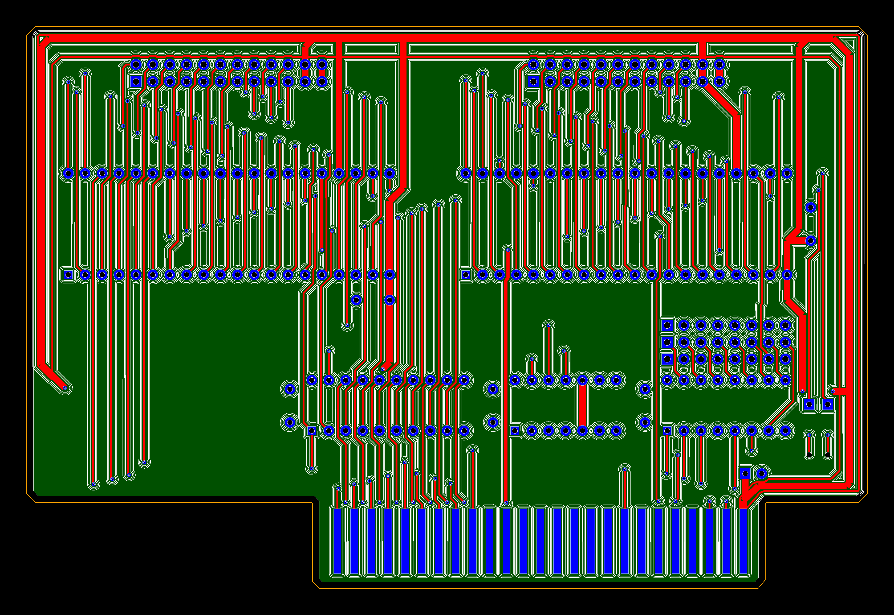

# ⚙️ KiCad Gerber to CNC G-Code Generator (Python)

This Python script is a robust tool designed to transform **KiCad Gerber** and **Excellon drill files** into optimized **G-Code** for PCB milling machines. It handles trace isolation routing, drilling, and incorporates advanced features like **edge cut clearance**  generation for clean board separation.

The script is based on Matthias Wandel script:
https://github.com/Matthias-Wandel/Gerber2nc

## ✨ Features

* **Automatic Toolpath Generation:** Converts copper traces into offset paths for isolation milling using `shapely`.
* **Coordinate Alignment:** Automatically shifts and aligns the PCB contour (Edge Cuts) to a safe starting position (**5.0mm, 5.0mm**).
* **Multi-Pass Isolation:** Supports multiple passes with defined spacing for wider isolation areas.
* **Two-Group Drilling:** Separates holes into "small" and "large" groups for optimized drilling with different tools.
* **Contour Separation:** Generates a final edge cut G-code file with a customizable **clearance offset**.
* **Visualization:** Outputs a `.png` image showing all toolpaths, holes, and the PCB contour with clearance and tabs.

<p>

<p>
   
---

## 🚀 Getting Started

### Prerequisites

This script requires the `shapely`, `Pillow`, and `numpy` libraries.

```bash
pip install shapely Pillow numpy
````

### Usage

1.  **Export KiCad Files:** Ensure you have the following files generated from KiCad in the same directory as the script:

      * `[ProjectName]-F_Cu.gbr` (Front Copper Layer)
      * `[ProjectName]-Edge_Cuts.gbr` (Board Outline)
      * `[ProjectName]-PTH.drl` (Plated Through Holes/Drill File)

2.  **Run the Script:** Execute the script from your command line, passing the base name of your project files (e.g., `MyBoard`).

<!-- end list -->

```bash
python3 gerber2nc_v2.py MyBoard
```

### Output Files

The script will generate the following files:

  * `MyBoard_Engraving.nc` (G-Code for trace isolation)
  * `MyBoard_Small_Drill.nc` (G-Code for small holes)
  * `MyBoard_Large_Drill.nc` (G-Code for large holes)
  * `MyBoard_Edge_Cut.nc` (G-Code for final board marking the PCB outline, use a bandsaw for final separation)
  * `MyBoard_visualization.png` (Visual map of all toolpaths)

-----

## 🛠️ Configuration Parameters

The milling behavior and path generation are controlled by the following parameters, which are set at the top of the Python script. **Adjust these values** based on your tooling, machine capabilities, and material.

| Group | Parameter | Value | Description |
| :--- | :--- | :--- | :--- |
| **PCB & Opt.** | `SAFETY_PADDING` | `5.0` | **Space from origin (mm).** Sets the absolute position of the PCB's bottom-left corner. |
| **PCB & Opt.** | `FLOAT_TOLERANCE` | `1e-4` | Tolerance used for float comparisons and geometry cleanup. |
| **PCB & Opt.** | `SMALL_HOLE_MAX_DIAMETER` | `0.85` | Max diameter (mm) for a hole to be grouped for the `Small_Drill` file. |
| **CNC Milling** | `SPINDLE_SPEED` | `12000` | Spindle speed in RPM. |
| **CNC Milling** | `CUT_DEPTH` | `-0.1` | **Trace isolation depth (mm).** |
| **CNC Milling** | `FINAL_CUT_DEPTH` | `-1.8` | **Final edge cut depth (mm).** Must be deeper than the PCB thickness. |
| **CNC Milling** | `SAFE_HEIGHT` | `3.0` | Z-axis height (mm) for rapid moves. |
| **CNC Milling** | `PLUNGE_FEED_RATE` | `200` | Z-axis feed rate (mm/min) for plunging into the material. |
| **CNC Milling** | `FEED_RATE` | `450` | XY feed rate (mm/min) for trace isolation routing. |
| **CNC Milling** | `CUT_FEED_RATE` | `300` | XY feed rate (mm/min) for final edge cutting. |
| **CNC Milling** | `HOLE_START_DEPTH` | `0.1` | Initial depth for drilling (ensures positive contact before plunging). |
| **CNC Milling** | `HOLE_FINAL_DEPTH` | `-1.8` | Final drilling depth (mm). |
| **Isolation** | `ISOLATION_OFFSET` | `0.22` | **First pass distance (mm)** from the trace center line (tool radius dependent). |
| **Isolation** | `ISOLATION_PASSES` | `3` | Total number of passes for isolation. |
| **Isolation** | `PASS_SPACING` | `0.2` | Lateral spacing (mm) between consecutive isolation passes. |
| **Outline** | `EDGE_CUT_CLEARANCE_OFFSET` | `1.0` | **Clearance offset (mm)** added around the board outline *before* calculating tabs and the tool center path. |

-----

## 🖼️ Visualization Output

The `_visualization.png` file provides a critical pre-flight check of all toolpaths.

  * **Dark Green:** The original PCB area defined by Edge Cuts.
  * **White Lines:** Trace Isolation Toolpaths.
  * **Green Lines:** Shallow Cut (`TAB_HEIGHT`) segments corresponding to the tab areas.
  * **Red/Blue/Black:** Traces, Pads, and Holes (for context).

<!-- end list -->

