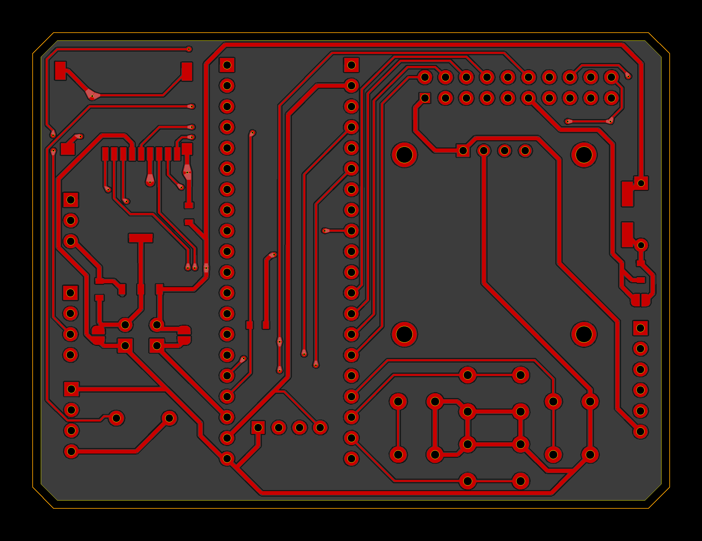

# ⚙️ Gerber2nc — KiCad Gerber to CNC G-Code (PCB Isolation Milling)

Two Python scripts that turn a **KiCad Gerber/Excellon export** into ready-to-run **G-code** for milling a single-sided PCB on a CNC machine (trace isolation, drilling, board-outline cutout, and bed-leveling helpers).



*Gray = board, red = copper (traces, pads, drilled islands), orange = copper zone/teardrop fill, yellow = board outline & drill rims, white = isolation milling toolpath.*

## ⚠️ Disclaimer

**THE SOFTWARE IS PROVIDED "AS IS", WITHOUT WARRANTY OF ANY KIND, EXPRESS OR IMPLIED, INCLUDING BUT NOT LIMITED TO THE WARRANTIES OF MERCHANTABILITY, FITNESS FOR A PARTICULAR PURPOSE AND NONINFRINGEMENT. IN NO EVENT SHALL THE AUTHORS OR COPYRIGHT HOLDERS BE LIABLE FOR ANY CLAIM, DAMAGES OR OTHER LIABILITY, WHETHER IN AN ACTION OF CONTRACT, TORT OR OTHERWISE, ARISING FROM, OUT OF OR IN CONNECTION WITH THE SOFTWARE OR THE USE OR OTHER DEALINGS IN THE SOFTWARE.**

**BY USING THIS SCRIPT AND THE GENERATED G-CODE, YOU AGREE TO ASSUME ALL RISKS AND RESPONSIBILITIES FOR ANY PERSONAL INJURY, EQUIPMENT DAMAGE, OR OTHER LOSSES THAT MAY RESULT FROM THE OPERATION OF YOUR CNC MACHINE.**

The user is solely responsible for verifying all generated G-code before running it, keeping the machine's work area clear and safe, and confirming that tool offsets, depths, feed rates, and RPM values are appropriate for their own CNC machine and material.

---

## 1. Workflow overview

The workflow is split into two independent scripts, run in order:

### Stage 1 — `pcb_preparation.py`

Reads only the board outline (`-Edge_Cuts.gbr`) and produces the files needed to physically place the PCB on the CNC bed and probe it for bed-leveling compensation.

* Positions the board outline `SAFETY_PADDING` mm from the machine origin and sequences its points into a clean, deduplicated, closed loop.
* Generates a restricted `G29` bed-mesh probing routine sized to the board's bounding box.
* Generates a G-code path that traces the board perimeter, for a quick visual placement check.
* Renders a PNG showing the positioned board and the probing area.

### Stage 2 — `gerber2nc_v2.py`

Reads the copper layer, drill file, and board outline (`-F_Cu.gbr`, `-PTH.drl`, `-Edge_Cuts.gbr`) and produces the actual machining toolpaths.

* Parses Gerber apertures (circle, rectangle, obround, KiCad `RoundRect`, and general aperture **macros** — including rotated free-form polygon pads) and Gerber **region** (`G36`/`G37`) zone fills.
* Builds the copper geometry with [`shapely`](https://shapely.readthedocs.io/) and offsets it outward (one or more passes) to generate an **isolation milling** toolpath around every trace, pad, and copper zone.
* Splits drilled holes into a "small" and a "large" group (configurable diameter threshold) so each can be drilled with the appropriate bit.
* Generates a final board-outline cut path, enlarged by a configurable clearance so the mill doesn't eat into the traced perimeter.
* Renders a PNG visualization of the whole job (see the color legend below).

---

## 2. Getting started

### Prerequisites

```bash
pip install -r requirements.txt
```

`requirements.txt` currently pulls in `numpy`, `shapely`, `matplotlib`, and `Pillow`.

### Export the KiCad files

From KiCad's PCB Editor, export (Plot + Generate Drill Files) the following, using the **same base project name**, into the directory where you'll run the scripts:

* `<Board>-F_Cu.gbr` — front copper layer
* `<Board>-Edge_Cuts.gbr` — board outline
* `<Board>-PTH.drl` — plated through-hole drill file (Excellon)

### Run it

```bash
# Stage 1 — placement & bed mesh (interactive prompt for the base name)
python3 pcb_preparation.py

# Stage 2 — machining toolpaths
python3 gerber2nc_v2.py <Board>
```

`gerber2nc_v2.py` also prompts interactively for the base name if you run it with no arguments.

---

## 3. Output files

### `pcb_preparation.py`

| File | Description |
| :--- | :--- |
| `<Board>_BedMesh_G29_CNC.gcode` | Restricted `G29` bed-mesh probing routine over the board area. |
| `<Board>_ContourMapping_CNC.gcode` | Traces the board perimeter `CONTOUR_REPETITIONS` times, for placement verification. |
| `<Board>_ContourMapping_Visualization.png` | Plot of the sequenced/positioned outline. |

### `gerber2nc_v2.py`

| File | Description |
| :--- | :--- |
| `<Board>_Engraving.nc` | Trace isolation milling (copper, pads, and copper-zone fills). |
| `<Board>_Small_Drill.nc` | Drilling for holes ≤ `SMALL_HOLE_MAX_DIAMETER`. |
| `<Board>_Large_Drill.nc` | Drilling for holes above that threshold. |
| `<Board>_Edge_Cut.nc` | Final board outline cut (offset outward by `EDGE_CUT_CLEARANCE_OFFSET`). |
| `<Board>_visualization.png` | Full-job visualization: board, copper, toolpaths, and drill holes. |

---

## 4. Configuration parameters

Both scripts are configured via constants near the top of the file — edit them directly for your machine, tooling, and material.

### `pcb_preparation.py`

| Parameter | Default | Description |
| :--- | :--- | :--- |
| `BED_SIZE_X` / `BED_SIZE_Y` | `240.0` / `220.0` | CNC bed size (mm), used to clamp the bed-mesh probing area. |
| `SAFETY_PADDING` | `10.0` | Offset (mm) of the board's bottom-left corner from the machine origin. |
| `Z_HOMING_FINAL` | `30.0` | Z height (mm) after homing / at the end of a job. |
| `Z_MAPPING_HEIGHT` | `5.0` | Z height (mm) while tracing the contour-mapping path. |
| `FAST_SPEED` | `10000` | `G0` rapid-move feed rate (mm/min). |
| `CONTOUR_SPEED` | `5000` | `G1` feed rate (mm/min) while tracing the contour. |
| `CONTOUR_REPETITIONS` | `5` | Number of times the contour-mapping path repeats the perimeter loop. |
| `BED_MESH_COMMAND` | `M420 S1` | G-code sent to enable saved bed-leveling compensation. |

### `gerber2nc_v2.py`

| Parameter | Default | Description |
| :--- | :--- | :--- |
| `SAFETY_PADDING` | `5.0` | Offset (mm) of the board's bottom-left corner from the machine origin. |
| `SMALL_HOLE_MAX_DIAMETER` | `0.85` | Max hole diameter (mm) grouped into `Small_Drill`. |
| `SPINDLE_SPEED` | `12000` | Spindle speed (RPM, `S` word). |
| `CUT_DEPTH` | `-0.1` | Trace isolation milling depth (mm). |
| `FINAL_CUT_DEPTH` | `-1.8` | Board-outline cut depth (mm). |
| `SAFE_HEIGHT` | `3.0` | Z height (mm) for rapid travel between operations. |
| `PLUNGE_FEED_RATE` | `200` | Z-axis plunge feed rate (mm/min). |
| `FEED_RATE` | `450` | XY feed rate (mm/min) while milling traces. |
| `CUT_FEED_RATE` | `300` | XY feed rate (mm/min) while cutting the board outline. |
| `HOLE_START_DEPTH` | `0.1` | Z height (mm) above the board where a drilling plunge begins. |
| `HOLE_FINAL_DEPTH` | `-1.8` | Final drilling depth (mm). |
| `ISOLATION_OFFSET` | `0.1` | Distance (mm) of the first isolation pass from the trace/pad centerline. |
| `ISOLATION_PASSES` | `3` | Number of isolation passes (each one further from the copper). |
| `PASS_SPACING` | `0.02` | Extra lateral distance (mm) between successive isolation passes. |
| `EDGE_CUT_CLEARANCE_OFFSET` | `1.0` | How far (mm) outward the final board-outline cut is offset from the drawn edge. |

---

## 5. Visualization color legend

The `_visualization.png` produced by `gerber2nc_v2.py` uses a KiCad-like palette:

| Color | Meaning |
| :--- | :--- |
| 🩶 Gray | Board area (inside the outline). |
| 🟥 Red | Traces, pads, and drilled copper islands. |
| 🟧 Orange | Interior fill of copper zones / teardrops (Gerber `G36`/`G37` regions). |
| 🟨 Yellow | Board outline and drill-hole rims. |
| ⬜ White | Calculated isolation-milling toolpath. |
| ⬛ Black | Drilled holes and everything outside the board. |

---

## 6. Operating the CNC

This workflow was developed and tested on a CNC machine converted from an **Anycubic Mega-S 3D printer**, running a **custom Marlin firmware** build that supports bed-mesh probing and spindle control for isolation milling. Adapt the steps below to your own machine and firmware.

### Phase 1 — Placement & bed mesh (`pcb_preparation.py` output)

1. **Check the visualization** — open `<Board>_ContourMapping_Visualization.png` and confirm the board is positioned as expected on the work area.
2. **Tool change** — mount the V-engraving bit you'll use for isolation milling (typically a 30° / 0.1–0.2 mm tip).
3. **Secure the board** — tape it down firmly and flat; it must not shift during probing or milling.
4. **Run `<Board>_ContourMapping_CNC.gcode`** to trace the perimeter at a safe height and visually confirm alignment against the physical board.
5. **Connect the probe** — one lead to an exposed conductive area of the board, the other to the milling bit tip. A poor connection can let the Z-axis plunge unchecked, risking tool breakage or damage to the board/machine.
6. **Run `<Board>_BedMesh_G29_CNC.gcode`** — the machine probes the board area and saves the mesh (`M500`).
7. **Disconnect the probe** immediately afterward.

### Phase 2 — Milling and drilling (`gerber2nc_v2.py` output)

1. **Safety check** — confirm the board is still secure, the correct bit is mounted and tight, and the probe leads are clear of the cutting area.
2. **Run `<Board>_Engraving.nc`** — isolates all copper (traces, pads, zone fills) using the saved bed-mesh compensation.
3. **Run `<Board>_Edge_Cut.nc`** — scores the final board outline (offset outward by `EDGE_CUT_CLEARANCE_OFFSET`) for later manual/final cutout.
4. **Drilling (manual Z-referencing required):** bed-mesh compensation is *not* used for drilling — probing an already-isolated board risks landing on non-conductive copper and missing the trigger entirely. Before each of the two drilling passes:
   1. Change to the appropriate drill bit (small first).
   2. Manually jog the bit to touch the probe against a still-conductive, un-isolated area of the board (avoid isolated traces).
   3. Send `G30`, note the measured Z value (e.g. `Z-7.7`).
   4. Send `M206` with the **inverted** sign of that value (e.g. `M206 Z7.7`) to set the Z offset.
   5. Disconnect the probe.
   6. Run `<Board>_Small_Drill.nc`, then repeat the referencing steps and run `<Board>_Large_Drill.nc`.

---

## Credits

Based on the original script by [Matthias Wandel](https://github.com/Matthias-Wandel/Gerber2nc).
Improved and maintained by Alessandro Miertschink.
